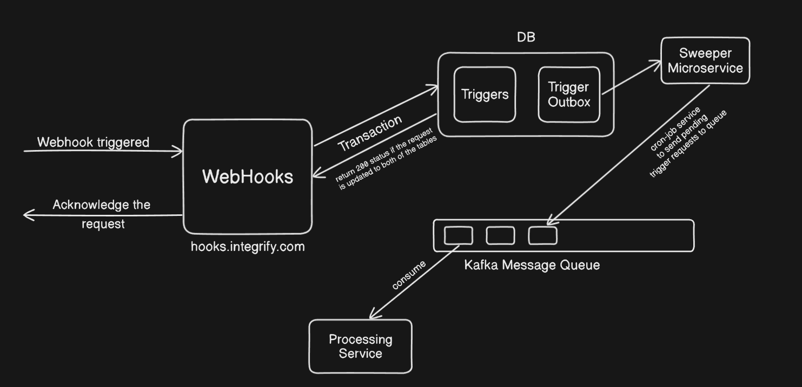

# Integrify

## HLD Diagram

### Transactional Outbox Pattern
The purpose of using this pattern is that we want atomicity. The request must be delivered simultaneously to both the database and to he message queue,but this type of transaction is bit difficult to construct for the given layout, but we have an alternative that we can have transaction with databases, so we implement the database transaction to write the incoming trigger to two tables, one is the 'trigger' table and the second is 'trigger-outbox'. The inputs from the trigger-outbox are fetched by 'Sweeper' and pushed to kafka queue in every 'x' interval of time (cron-job), the request from the queue is then processed by several other tasks which are the actions listed with the webhook metadata

